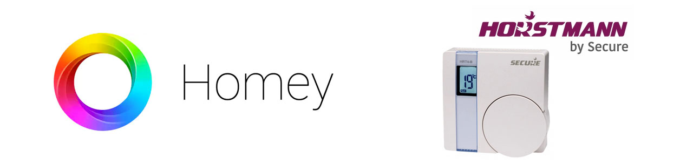

# Secure Meters
  

Adds support for Secure (previously Horstmann) devices to Homey.

## Supported Devices
- [SRT 321 / HRT4-ZW Thermostat](https://products.z-wavealliance.org/products/1563) - [Manual](https://products.z-wavealliance.org/ProductManual/File?folder=&filename=MarketCertificationFiles/1563/SRT321%20User%20MAnual.pdf)

### Experimental Support
- [SES 002 Pipe/Tank Sensor](http://z-wavelab.com/index.php?route=product/product&product_id=532) attached to SES 303 - [Manual](http://z-wavelab.com/image/catalog/PDF/SES002%20SES003.pdf)
- [SES 302 Temperature Sensor](https://products.z-wavealliance.org/products/1240) - [Manual](https://products.z-wavealliance.org/ProductManual/File?folder=&filename=MarketCertificationFiles/1240/SES%20302%20and%20303%20TH%20Sensors%20User%20Installation%20Manual,%20(Secure%20Controls%20UK%20Ltd)%20BGX501-923-R02.pdf)
- [SES 303 Temperature & Humidity Sensor](https://products.z-wavealliance.org/products/1175) - [Manual](https://products.z-wavealliance.org/ProductManual/File?folder=&filename=MarketCertificationFiles/1240/SES%20302%20and%20303%20TH%20Sensors%20User%20Installation%20Manual,%20(Secure%20Controls%20UK%20Ltd)%20BGX501-923-R02.pdf)
- [SRT 323 Thermostat](https://products.z-wavealliance.org/products/1241)
- [SSR 302 Dual Channel Power Switch](https://products.z-wavealliance.org/products/1619) - [Manual](https://products.z-wavealliance.org/ProductManual/File?folder=&filename=MarketCertificationFiles/1619/SSR%20302%20User%20Manual.pdf)
- [SSR 303 / ASR-ZW Power Switch](https://products.z-wavealliance.org/products/1618) - [Manual](https://products.z-wavealliance.org/ProductManual/File?folder=&filename=MarketCertificationFiles/1618/SSR%20303%20User%20Manual.pdf)
- [SCS 317 / C17-ZW Programmable Room Thermostat](https://products.z-wavealliance.org/products/864)
- [SIR 321](https://products.z-wavealliance.org/products/1012/)

## License
This project is licensed under MIT - https://opensource.org/licenses/MIT

## Photo
Cover photo by [Max Vakhtbovych](https://www.pexels.com/photo/cozy-living-room-with-comfortable-sofa-and-minimalist-furniture-6283961/)

## Contributors ✨

Thanks goes to these wonderful people ([emoji key](https://allcontributors.org/docs/en/emoji-key)):

<!-- ALL-CONTRIBUTORS-LIST:START - Do not remove or modify this section -->
<!-- prettier-ignore-start -->
<!-- markdownlint-disable -->
<table>
  <tr>
    <td align="center"><a href="https://github.com/hankolsen"> <b>hankolsen</b></a> <a href="https://github.com/hankolsen/com.securemeters.horstmann/commits?author=hankolsen" title="Code">💻</a> <a href="#design-hankolsen" title="Design">🎨</a> <a href="#ideas-hankolsen" title="Ideas, Planning, & Feedback">🤔</a></td>
    <td align="center"><a href="https://www.splitbrain.com"> <b>Darryl van der Peijl</b></a> <a href="https://github.com/hankolsen/com.securemeters.horstmann/issues?q=author%3ADarrylvanderPeijl" title="Bug reports">🐛</a> <a href="https://github.com/hankolsen/com.securemeters.horstmann/commits?author=DarrylvanderPeijl" title="Code">💻</a></td>
    <td align="center"><a href="https://github.com/arvid-r"> <b>Arvid Rosen</b></a> <a href="https://github.com/hankolsen/com.securemeters.horstmann/issues?q=author%3Aarvid-r" title="Bug reports">🐛</a></td>
    <td align="center"><a href="https://github.com/Rocodamelshe"> <b>Rocodamelshe</b></a> <a href="https://github.com/hankolsen/com.securemeters.horstmann/commits?author=Rocodamelshe" title="Tests">⚠️</a></td>
    <td align="center"><a href="https://github.com/jmdraper"> <b>jmdraper</b></a> <a href="#ideas-jmdraper" title="Ideas, Planning, & Feedback">🤔</a></td>
    <td align="center"><a href="https://github.com/theSequencer82"> <b>theSequencer82</b></a> <a href="#ideas-theSequencer82" title="Ideas, Planning, & Feedback">🤔</a></td>
    <td align="center"><a href="https://github.com/SPAeotec"> <b>SPAeotec</b></a> <a href="https://github.com/hankolsen/com.securemeters.horstmann/issues?q=author%3ASPAeotec" title="Bug reports">🐛</a></td>
  </tr>
</table>

<!-- markdownlint-restore -->
<!-- prettier-ignore-end -->

<!-- ALL-CONTRIBUTORS-LIST:END -->

This project follows the [all-contributors](https://github.com/all-contributors/all-contributors) specification. Contributions of any kind welcome!

## Author
This project is Developed and Maintained by **[Hank de Lang](https://github.com/hankolsen)**

## Support your ~~local~~ remote developer
If you find this useful you can always by me a coffee:

---

:computer: Made with :metal: and :heart: by Hank 
